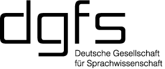

# Welcome to the DGfS-CL Fall School 2019

The
[Computational Linguistics Fall School](https://dgfs.de/en/cl/fall-schools.html)
was established in 2001 by the
[Special Interest Group on Computational Linguistics](https://dgfs.de/en/cl/)
of the
[German Linguistic Society (Deutsche Gesellschaft für Sprachwissenschaft, DGfS)](https://dgfs.de/en/).

Since then, the fall school is a biennial event for students who wish
to broaden their knowledge of techniques and methods used in natural
language processing, including computational linguistics fields not
traditionally taught in standard degree programs.

This is the 10th Fall School offering four courses, each of which
consists of ten 90-minutes lectures. All courses will be taught in
English. Students can receive credits for the courses at their home
university under the European Credit Transfer System (ECTS).

[{:height="100px"}](http://www.ims.uni-stuttgart.de/index.en.html)
[{:align="right" height:="100px"}](http://dgfs.de/en)

